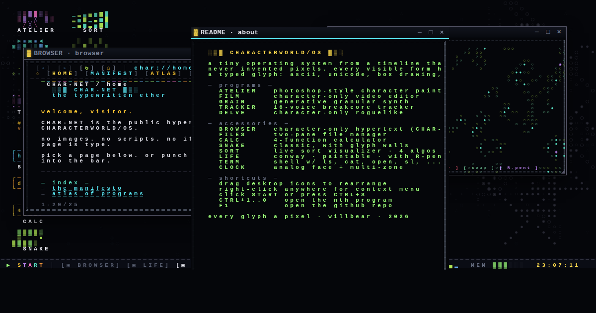

# characterworld

> a tiny operating system from a timeline that never invented pixels

**Live:** [willbearfruits.github.io/characterworld](https://willbearfruits.github.io/characterworld/)



The landing page is **CHARACTERWORLD/OS** — a character-only desktop in the browser. Drag icons. Open windows. Right-click for context. Browse the typewritten internet. Every visible form is a typed glyph: ASCII, Unicode, box drawing, blocks, combining marks. No raster images, no SVG illustrations, no canvas path geometry, no CSS decorative shapes. A font is the only graphics card.

---

## The OS

A real desktop, built entirely from typed characters:

- **mycelium wallpaper** — colored tips that walk a grid, branch, and leave fading heat trails
- **draggable icons** — positions persisted across sessions
- **window manager** — drag title bars, resize, minimize/maximize, focus z-order, taskbar pills tinted by program accent
- **start menu + right-click context menus** everywhere
- **boot animation** with a CRT-flash log

### Programs

The OS ships with thirteen of them, all character-only:

| | program | what it is |
|---|---|---|
| ▓ | **ATELIER** | photoshop-style character paint program |
| ▓ | **FILM** | character-only video editor (webcam → glyphs, export GIF/PNG/ANSI/MP4) |
| ▓ | **GRAIN** | generative granular synth, mycelium scheduler, keyboard + gamepad |
| ▓ | **TRACKER** | 16-voice breakcore tracker, polyrhythmic, glyph knobs |
| ▓ | **DELVE** | character-only roguelike, every footstep a grain |
| ░ | **BROWSER** | character-only hypertext reader of the internal CHAR-NET |
| ░ | **FILES** | two-pane file manager, opens real READMEs in-frame |
| ░ | **CALC** | four-function calculator |
| ░ | **SNAKE** | classic, with `▓` walls and `●` food |
| ░ | **SORT** | live sort visualizer · bubble · insertion · selection · cocktail |
| ░ | **LIFE** | Conway's Game of Life, paintable, with R-pentomino preset |
| ░ | **TERM** | shell with `ls`, `cat`, `open`, `cowsay`, `sl`, `matrix`, ... |
| ░ | **CLOCK** | analog face + multi-zone digital strip |

Heavy programs (▓) live in their own directories under this repo. Light accessories (░) are built into the OS.

### Keyboard

| | |
|---|---|
| `CTRL+S` | toggle start menu |
| `CTRL+1..9, 0` | open the Nth program |
| `right-click` | context menu (desktop, icon, taskbar pill, window title) |
| `F1` | open this repo on GitHub |
| `ESC` | close menus and popups |

---

## Repository layout

```
characterworld/
├─ index.html              CHARACTERWORLD/OS — the desktop, single file
├─ og.png                  social card (rendered from the OS)
├─ AGENTS.md               shared character-only policy (authoritative)
├─ CLAUDE.md               guidance for AI collaborators
├─ skills/
│  └─ character-only-art/  shared policy skill
├─ charactershop/          ATELIER — single-file paint program
├─ characterfilm/          FILM — ES-module video editor
├─ charactergrain/         GRAIN — granular synth, mycelium scheduler
├─ charactertracker/       TRACKER — 16-voice tracker
└─ characterdelve/         DELVE — roguelike with grain footsteps
```

Each child has its own README. Each is self-contained: no frameworks, no bundlers, no npm. Plain HTML + JS, served as static files.

---

## Project Law

See [`AGENTS.md`](AGENTS.md) and [`skills/character-only-art/SKILL.md`](skills/character-only-art/SKILL.md). Every child inherits the same rule:

> Every visible form is a typed glyph. No images. No SVG. No path geometry. CSS only for layout, color, font, and transforms.

The one allowed exception is OpenGraph / social-card PNGs — their pixels happen to depict character art (`og.png` here was rendered from the OS itself).

Sibling repo: [`characterglitch`](https://github.com/willbearfruits/characterglitch) established the base style — standalone browser pieces, glyph grids, ASCII/Unicode/Zalgo corruption, dark void palettes, direct canvas rendering.

---

## Run it locally

```bash
python3 -m http.server 8000
# then open http://localhost:8000/
```

The root page is the OS. From there you can drag icons, open windows, browse CHAR-NET, or descend into any sibling project at e.g. `http://localhost:8000/charactergrain/`.

---

## License

MIT — see [`charactershop/LICENSE`](charactershop/LICENSE). Future siblings may ship their own LICENSE files inside their subdirectories.

— *every glyph a pixel · willbear · 2026*
