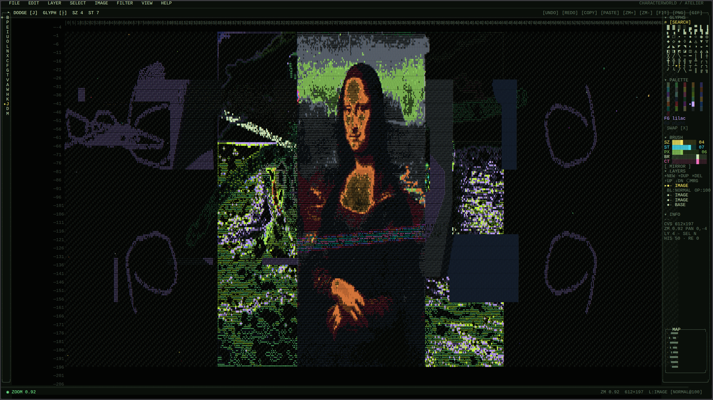

# characterworld / atelier

**Character-only Photoshop-style paint & composite program. Single HTML file. Zero dependencies.**

Every visible form — the painting, the cursor, the UI, the borders, the selection marching ants, the minimap — is built from typed glyphs. No images, no SVG illustrations, no vector shapes. The medium *is* characters.



**Live:** [willbearfruits.github.io/characterworld/charactershop](https://willbearfruits.github.io/characterworld/charactershop/)

---

## Features

### Layers
- Multiple layers with reorder, duplicate, delete, merge-down, flatten
- Per-layer visibility, lock, opacity (0–100), blend modes: **NORMAL**, **SCREEN**, **MULTIPLY**, **STACK**, **CORRUPT**, **BEHIND**
- Onion-skin preview of inactive layers

### Selections & Clipboard
- Rectangular **marquee**, freehand **lasso**, **magic wand** (by similar glyph + color), select-all / invert / deselect, select-from-layer-glyphs
- Marching ants rendered as alternating `╳ ┼` glyphs
- **Cut / copy / paste** constrained by selection mask
- Move tool — cut selection, drag anywhere, release to drop

### 21 tools
**B** brush · **P** pencil · **E** erase · **I** eyedrop · **U** smear · **O** corrupt · **L** bloom
**N** line · **X** box · **C** orb · **F** fill · **G** gradient · **T** type
**V** marquee · **A** lasso · **W** magic wand · **H** move · **K** clone (alt-click source)
**J** dodge · **D** burn · **M** mirror

### Filters
Invert palette · Zalgo corrupt · Noise · Pixelate · Character blur · Sharpen · Edge detect · Posterize · Scanlines · Glitch shift · Density fill · Threshold · Clean marks

### Image menu
Resize canvas · Crop to selection · Flip H / V · Rotate 90° CW / CCW · Shift hue

### Import / Export
- **Import image** — drops any image onto a new layer, dithered to the palette as glyphs, with live brightness/contrast controls
- **PNG** — rasterized character render
- **Animated GIF** — 16 frames of zalgo/density phase animation
- **TXT** — plain character dump
- **ANSI** — true-color 24-bit ANSI escape sequences (paste into a terminal)
- **JSON project** (`.cwp.json`) — full layer stack, save/load round-trip
- **localStorage** — quick save / load
- **Copy as text** — composited grid to clipboard

### View
- **Zoom** 0.3×–4× (Ctrl+Wheel, `+` / `-`, `0` fit, `1` actual)
- **Pan** (Space+drag, arrow keys)
- **Rulers**, **grid**, **minimap** with viewport box
- **4 color themes** (press `T` to cycle)

### History
- 64-deep undo/redo with labelled states

---

## Keyboard

| Key | Action |
|---|---|
| `B` `P` `E` `I` `U` `O` `L` `N` `X` `C` `F` `G` `T` `V` `A` `W` `H` `K` `J` `D` `M` | Tool shortcuts |
| `[` `]` | Brush size |
| `Alt+Wheel` | Brush strength |
| `Shift+Wheel` | Cycle glyph |
| `Wheel` | Brush size |
| `Ctrl+Wheel` | Zoom |
| `+` `-` `0` `1` | Zoom in / out / fit / actual |
| `Space+drag` | Pan |
| Arrow keys | Pan |
| `Ctrl+Z` / `Ctrl+Shift+Z` / `Ctrl+Y` | Undo / Redo |
| `Ctrl+C` `Ctrl+X` `Ctrl+V` | Copy / Cut / Paste |
| `Ctrl+A` `Ctrl+D` `Ctrl+Shift+I` | Select all / Deselect / Invert |
| `Ctrl+S` `Ctrl+O` | Save / Load (localStorage) |
| `Ctrl+Shift+N` | New layer |
| `Ctrl+J` | Duplicate layer |
| `Ctrl+E` | Merge down |
| `Ctrl+[` `Ctrl+]` | Layer down / up |
| `G` `T` | Grid toggle / cycle theme |
| `Alt+click` | Eyedrop / set clone source |
| `Enter` | Commit type tool |
| `Esc` | Close menu / cancel / deselect |

---

## Run it

No build. No install.

```bash
# Any static server, e.g.
python3 -m http.server 8000
# then open http://localhost:8000
```

Or just double-click `index.html`.

---

## Project law

This project inherits **characterworld law**: every visible subject must be built from typed glyphs — ASCII, Unicode, box drawing, block elements, punctuation, combining marks. No raster images, no SVG illustrations, no canvas path geometry, no CSS decorative shapes. See [`../AGENTS.md`](../AGENTS.md).

Sibling project: [`characterglitch`](https://github.com/willbearfruits/characterglitch) established the base style — standalone browser pieces, glyph grids, ASCII/Unicode/Zalgo corruption, dark void palettes, direct canvas rendering.

---

## License

MIT — see [`LICENSE`](LICENSE).
